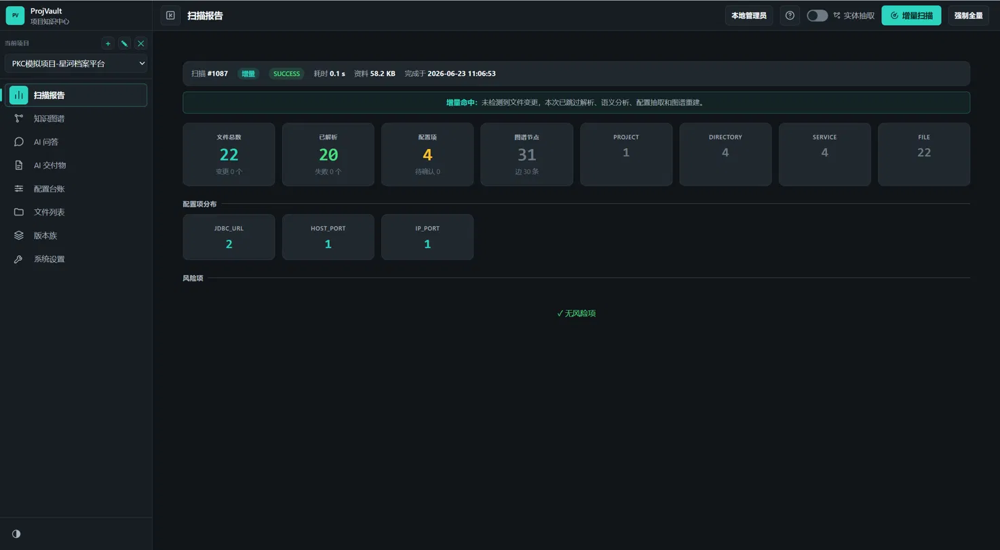
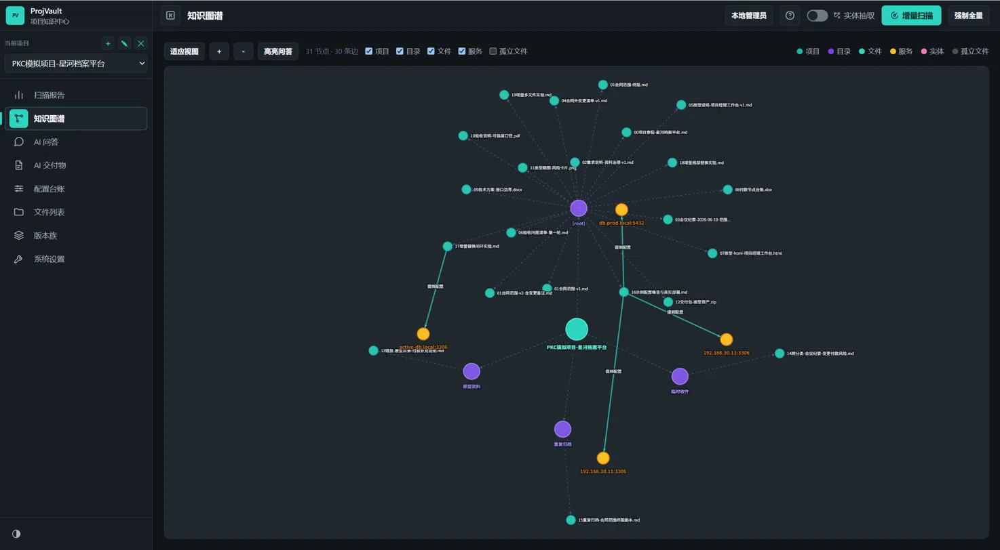
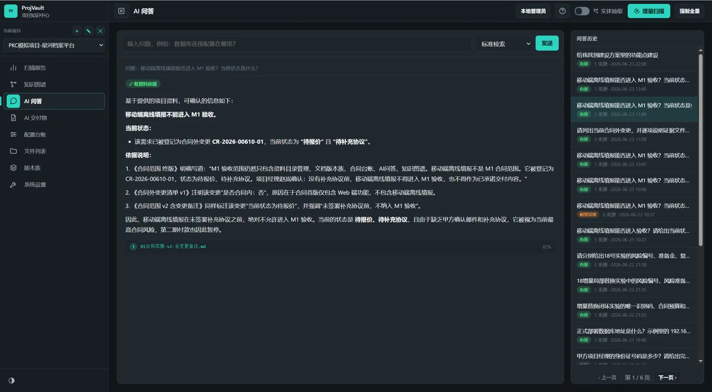
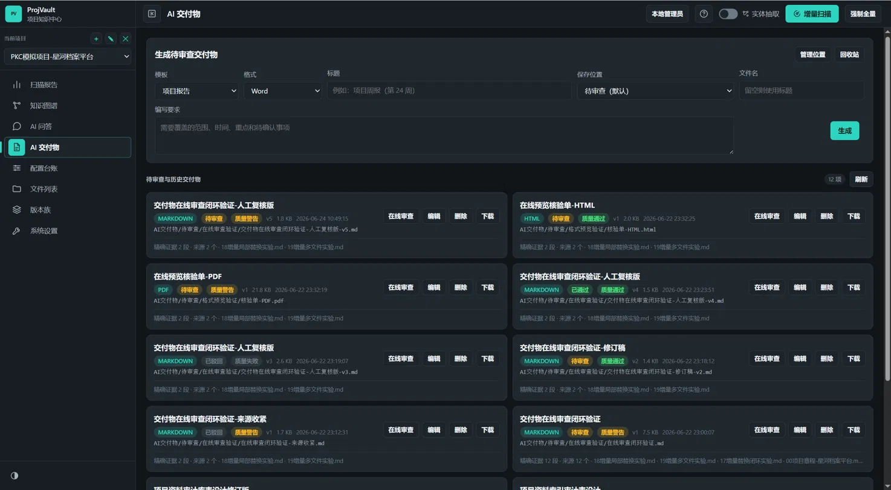

# ProjVault

[English](README.md) | 中文

ProjVault 是一个面向项目经理的开源项目知识中心。它把真实项目中混乱的资料目录转成可检索、可追溯、带证据的项目知识：支持混合文件扫描、增量变更识别、知识图谱、带来源问答、版本族治理，以及可在线审查的 AI 交付物生成。

> 当前状态：项目仍在早期开发中。当前公开重点模块是 Project Knowledge Center，也就是 PKC 项目知识中心。

## 解决什么真实困境

真实项目资料很少是干净的。项目经理拿到的往往是 Word、Excel、PDF、Markdown、HTML、截图、原型和压缩包混在一起的文件夹。文件可能被放错、重复、改名、局部替换，也可能夹杂示例文档、示例 IP/端口，甚至混入其他项目资料。

普通文件索引只能告诉你某个关键词出现过，但很难稳定回答：

- 哪个文件才是当前有效版本？
- 哪个变更属于合同外范围？
- 每条结论的证据来自哪个文件、章节、页码或表格？
- 某个 IP、端口、数据库地址是真实配置，还是示例噪音？
- 哪些文件和某个风险、合同条款、交付物或服务有关？

ProjVault 的目标就是补上这块能力。

## 项目截图

### 扫描报告



### 知识图谱



### 带证据的 AI 问答



### AI 交付物



更多截图见 [docs](docs/) 目录。

## 核心能力

- 项目档案 CRUD 与资料根目录管理
- 全量扫描与增量扫描
- 基于 SHA-256 的文件指纹识别
- 新增、修改、删除、重命名文件识别
- 多格式文档解析
- 配置项、服务端点和项目线索提取
- 示例资料、错放文件、跨项目线索等噪音过滤
- 带证据来源的 RAG 问答
- GraphRAG 风格的局部关系扩展
- 知识图谱可视化
- 问答历史
- 文档版本族聚类与版本对比
- AI 交付物生成、预览、质量检查、修订和审批
- 基于项目归属的 RBAC 权限隔离
- 用户级 AI API 配置，使用 AES-GCM 加密保存
- 黄金评测集与运行状态观测

## 技术栈

- Java 17
- Spring Boot 4.1
- Spring Data JPA / Hibernate
- H2 开发数据库
- MySQL 8 生产数据库
- Apache Tika 文档解析
- 原生 HTML / CSS / JavaScript 前端
- AntV G6 兼容图谱可视化
- 自定义 AI Provider 层，支持 mock、OpenAI-compatible 和 Anthropic 风格模型

## 快速启动

环境要求：

- JDK 17+
- 仓库内已包含 Maven Wrapper

开发环境启动：

```powershell
cd ProjVault
.\mvnw.cmd spring-boot:run
```

浏览器访问：

```text
http://localhost:8090/
```

默认本地账号：

```text
username: admin
password: admin123
```

共享环境或生产环境请修改初始管理员密码：

```powershell
$env:PROJVAULT_ADMIN_PASSWORD="replace-with-a-strong-password"
```

## AI 配置

系统支持：

- 本地开发用 mock provider
- DeepSeek、OpenAI 兼容网关、Qwen 兼容端点、Ollama 兼容端点等 OpenAI-compatible provider
- Anthropic 风格 provider

本地实验可在启动前设置：

```powershell
$env:LLM_API_KEY="your-api-key"
```

非管理员用户需要在系统界面中配置自己的 AI API。用户 API Key 会加密保存，接口不会返回明文，也不会沿用管理员或系统 API。

## 生产部署说明

生产环境建议使用 MySQL，并通过环境变量或部署平台 Secret 管理配置敏感信息。

关键变量：

```text
PROJVAULT_DB_PASSWORD
PROJVAULT_ADMIN_USERNAME
PROJVAULT_ADMIN_PASSWORD
PROJVAULT_SECRETS_MASTER_KEY
PROJVAULT_PDF_FONT_PATH
```

`PROJVAULT_SECRETS_MASTER_KEY` 必须是 Base64 编码的 32 字节密钥。不要提交生成的密钥、本地 H2 数据库、日志、真实项目资料或客户文档。

## 开源边界

公开仓库保留产品代码、SQL 迁移脚本、样例用例、截图和面向用户的文档。

以下本地或内部建设资料明确不进入开源仓库：

- `z/`：建设记录、实验记录、各种实施报告
- `AGENTS.md` 和 `CLAUDE.md`：本地 Agent 约束和私有项目指令
- `docs/*.md`：闭环验证记录
- `data/`：H2 数据库、本地项目数据、生成的加密主密钥
- `logs/`：本地运行日志
- GraphRAG 实验生成物

发布或打 tag 前建议运行：

```powershell
.\mvnw.cmd -q test
rg -n --hidden --glob '!target/**' --glob '!data/**' --glob '!logs/**' --glob '!z/**' "(?i)(api[_-]?key|secret|password|token|authorization|bearer|sk-[a-z0-9])" .
```

逐条人工确认命中项。占位示例可以保留，真实密钥不能提交。

## 许可证

本项目使用 Apache License 2.0，详见 [LICENSE](LICENSE)。
